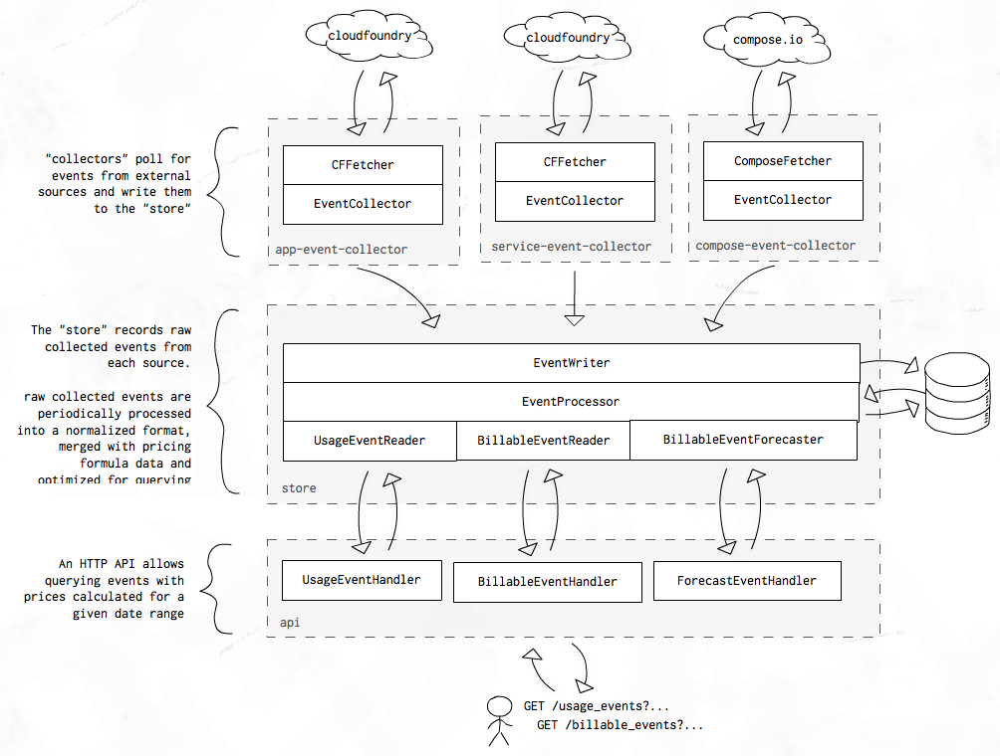

# paas-billing

⚠️
When merging pull requests,
please use the [gds-cli](https://github.com/alphagov/gds-cli)
or [github_merge_sign](https://rubygems.org/gems/github_merge_sign)
⚠️

* [Overview](#overview)
* [Installation](#installation)
* [Configuration](#configuration)
	* [Configuring Pricing Plans](#configuring-pricing-plans)
	* [Configuring the store](#configuring-the-store)
	* [Configuring the Collectors](#configuring-the-collectors)
	* [Configuring Cloudfoundry integration](#configuring-cloudfoundry-integration)
	* [Configuring the API server](#configuring-the-api-server)
* [API Usage](#api-usage)
	* [GET /usage_events](#get-usage_events)
	* [GET /billable_events](#get-billable_events)
	* [GET /forecast_events](#get-forecast_events)
	* [GET /pricing_plans](#get-pricing_plans)
* [Development](#development)
	* [Create a temporary Postgres server](#create-a-temporary-postgres-server)
	* [Run the application](#run-the-application)
	* [Run the tests](#run-the-tests)

## Overview

A Golang application that provides an API endpoint for querying a Cloudfoundry organisation's resource usage/costs over a given time period.

*Note that changes are currently being made to the way in which Paas billing works. The changes are underway and will be migrated over the next few weeks.*

Events are collected from multiple sources and stored in a postgres instance, normalized, combined with pricing configuration and then exposed for querying via an HTTP API.



The repository contains the following packages:

* `eventio` - a collection of interfaces that describe the system
* `eventcollector` - EventCollector's periodically poll for events via an eventio.EventFetcher
* `eventfetchers/cffetcher` - an `eventio.EventFetcher` that gets [cf usage events](http://apidocs.cloudfoundry.org/272/app_usage_events/list_all_app_usage_events.html)
* `eventstore` - implements `eventio.EventWriter` to persist eventio.RawEvents from collectors and implements `eventio.BillableEventReader` to read out the processed events.
* `apiserver` - an HTTP server that allows reading data from the store

## Installation

You will need:

* `Go v1.9+`

To build the application run the default make target:

```
make
```

You should then get a binary in `bin/paas-billing`.

The application has two commands to run the following components:
 - **api**: Runs the tenant-facing API server which can be scaled to any number of instances. Only queries the database.
 - **collector**: Runs all the processes to regularly collect usage information and produce billing data. There should be no multiple instances running.

E.g. to run the API you should use the following command:
```
./bin/paas-billing api
```

## Configuration

### Configuring Pricing Plans

You must tell the application how to map service plan GUID's to pricing formulas so that costs can be calculated.

These are configured via a `config.json` file in the `APP_ROOT` directory. Pricing plans can change over time and so all items in the config file have `valid_from` dates.

Here is an example plan configuration file including VAT rates and currency rates:

```javascript
{
  "currency_rates": [
    {
      "code": "GBP",
      "valid_from": "2011-01-01",
      "rate": 1
    },
    {
      "code": "USD",
      "valid_from": "2011-01-1",
      "rate": 0.8
    }
  ],
  "vat_rates": [
    {
      "code": "Standard",
      "valid_from": "epoch",
      "rate": 0.2
    }
  ],
  "pricing_plans": [
    {
      "name": "my-database-service",
      "valid_from": "2017-01-01",
      "plan_guid": "9befba08-c364-4d50-83d1-955b84a69989",
      "components": [
        {
          "name": "instance",
          "formula": "0",
          "currency_code": "GBP",
          "vat_code": "Standard"
        }
      ]
    },
    {
      "name": "app",
      "valid_from": "2017-01-01",
      "plan_guid": "f4d4b95a-f55e-4593-8d54-3364c25798c4",
      "components": [
        {
          "name": "instance",
          "formula": "$number_of_nodes * ceil($time_in_seconds / 3600) * ($memory_in_mb/1024.0) * 0.01",
          "currency_code": "USD",
          "vat_code": "Standard"
        },
        {
          "name": "storage",
          "formula": "($storage_in_mb/1024) * ceil($time_in_seconds / 3600) * 0.0001",
          "currency_code": "USD",
          "vat_code": "Standard"
        }
      ]
    }
  ]
}
```

**Writing formulas:**

The following variables are available for use in formulas:

| Name | Description | example |
|---|---|---|
| `$number_of_nodes` | number of instances | `$number_of_nodes * 0.1` |
| `$time_in_seconds` | the time period in seconds that the resource was active | `$time_in_seconds * 0.01` |
| `$memory_in_mb` | amount of memory used by resource in MB | `$memory_in_mb * 0.01` |

**Note**: variables may be `0` if they are not relevent to the resource.

The following functions are available for use in formulas:

| Name | Description | example |
|---|---|---|
| `ceil(number)` | converts to the nearest integer greater than or equal to argument. It can be used to calculate billable hours  | `ceil($time_in_seconds / 3600 * 1.5)` |

### Configuring the store

The store can be configured via the following environment variables

| Variable name | Type | Required | Default | Description |
|---|---|---|---|---|
|`APP_ROOT`|string|no|`$PWD`|absolute path to the application source to discover assets at runtime|
|`DATABASE_URL`|string|yes||Postgres connection string|
|`PROCESSOR_SCHEDULE`|duration|no|15m|how often to process the raw events into queryable BillableEvents|

### Configuring the Collectors

| Variable name | Type | Required | Default | Description |
|---|---|---|---|---|
|`COLLECTOR_SCHEDULE`|duration|no|1m|how often to fetch new data from the API|
|`COLLECTOR_MIN_WAIT_TIME`|duration|no|3s|if we are able to fetch the maximum number of items we only wait this much before the next fetch (this allows us to speed up the the processing if necessary)|

### Configuring Cloudfoundry integration

| Variable name | Type | Required | Default | Description |
|---|---|---|---|---|
|`CF_API_ADDRESS`|string|yes||Cloud Foundry API endpoint|
|`CF_CLIENT_ID`|string|yes|| Cloud Foundry client id|
|`CF_CLIENT_SECRET`|string|yes||Cloud Foundry client secret|
|`CF_SKIP_SSL_VALIDATION`|bool|no|false|skip the SSL certificate validation (use only for development!)|
|`CF_TOKEN`|string|no||Cloud Foundry OAuth token|
|`CF_USER_AGENT`|string|no||User agent when connecting to Cloud Foundry|
|`CF_FETCH_LIMIT`|integer|no|50|how many items to fetch from the API in one request, must be a positive integer. Max: 100.|
|`CF_RECORD_MIN_AGE`|duration|no|5m|stop processing records from the API if a record is found with less than a minimum age. This guarantees that we don't miss events from ongoing transactions.|

**Note**: in development you can use `CF_USERNAME` and `CF_PASSWORD` instead of `CF_CLIENT_ID` `CF_CLIENT_SECRET` to configure the CFFetcher

### Configuring the API server

| Variable name | Type | Required | Default | Description |
|---|---|---|---|---|
|`PORT`|integer|no|8881|port that the HTTP server will listen on|


The collectors/fetchers can be configured via the following environment variables


## API Usage

### `GET /usage_events`

UsageEvents are the normalized, processed events. Each event represents some kind of resource usage over a period of time.

A single event might represent a Cloudfoundry app running for 20mins, with 64MB memory and 3x instances. Another event might represent a medium mysql database that was running for 3hrs.

The `resource_guid` field references the subject of the event. For a cloudfoundry app event (`resource_type=app`) this would be an app guid. For a cloudfoundry service event (`resource_type=service`) this would be a service instance guid.

**Authorization:**

The `Authorization` header must contain a valid Cloudfoundry bearer token with permission to access the requested orgs is required.

**Query parameters:**

| Name | Type | Example | Notes |
|---|---|---|---|
| `range_start` | timestamp | 2001-01-01 | **required** start of period to query |
| `range_stop` | timestamp | 2017-01-01 | **required** end of period to query |
| `org_guid` | uuid | "2884b2bc-f74b-4aaa-956d-f679ca498dce" | can specify this param multiple times to request multiple orgs |

**Example:**

```
RANGE_START="2018-01-01"
RANGE_STOP="2018-02-01"
ORG_GUID="$(cf org my-org --guid)"

curl -s -G -H "Authorization: $(cf oauth-token)" 'http://localhost:8881/usage_events' \
	--data-urlencode "range_start=${RANGE_START}" \
	--data-urlencode "range_stop=${RANGE_STOP}" \
	--data-urlencode "org_guid=${ORG_GUID}"
```

**Returns:**

```javascript
[
	...
	{
		"event_guid":      "aa30fa3c-725d-4272-9052-c7186d4968a6",
		"event_start":     "2001-01-01T00:00:00+00:00",
		"event_stop":      "2001-01-01T01:00:00+00:00",
		"resource_guid":   "c85e98f0-6d1b-4f45-9368-ea58263165a0",
		"resource_name":   "APP1",
		"resource_type":   "app",
		"org_guid":        "51ba75ef-edc0-47ad-a633-a8f6e8770944",
		"space_guid":      "276f4886-ac40-492d-a8cd-b2646637ba76",
		"plan_guid":       "f4d4b95a-f55e-4593-8d54-3364c25798c4",
		"number_of_nodes": 3,
		"memory_in_mb":    1024,
		"storage_in_mb":   0,
	}
	...
]
```

### `GET /billable_events`

BillableEvents have all the same details as UsageEvents but they also contain a `price` field shows the cost calculated for the event.

**Authorization:**

The `Authorization` header must contain a valid Cloudfoundy bearer token with permission to access the requested orgs is required.

**Query parameters:**

| Name | Type | Example | Notes |
|---|---|---|---|
| `range_start` | timestamp | 2001-01-01 | **required** start of period to query |
| `range_stop` | timestamp | 2017-01-01 | **required** end of period to query |
| `org_guid` | uuid | "2884b2bc-f74b-4aaa-956d-f679ca498dce" | can specify this param multiple times to request multiple orgs |

**Example:**

```
RANGE_START="2018-01-01"
RANGE_STOP="2018-02-01"
ORG_GUID="$(cf org my-org --guid)"

curl -s -G -H "Authorization: $(cf oauth-token)" 'http://localhost:8881/billable_events' \
	--data-urlencode "range_start=${RANGE_START}" \
	--data-urlencode "range_stop=${RANGE_STOP}" \
	--data-urlencode "org_guid=${ORG_GUID}"
```

**Returns:**

```javascript
[
	...
	{
		"event_guid":      "aa30fa3c-725d-4272-9052-c7186d4968a6",
		"event_start":     "2001-01-01T00:00:00+00:00",
		"event_stop":      "2001-01-01T01:00:00+00:00",
		"resource_guid":   "c85e98f0-6d1b-4f45-9368-ea58263165a0",
		"resource_name":   "APP1",
		"resource_type":   "app",
		"org_guid":        "51ba75ef-edc0-47ad-a633-a8f6e8770944",
		"space_guid":      "276f4886-ac40-492d-a8cd-b2646637ba76",
		"plan_guid":       "f4d4b95a-f55e-4593-8d54-3364c25798c4",
		"quota_definition_guid": "dcb680a9-b190-4453-a2d1-cdb1377e42f4",
		"number_of_nodes": 1,
		"memory_in_mb":    1024,
		"storage_in_mb":   0,
		"price": {
			"inc_vat": "0.012",
			"ex_vat":  "0.01",
			"details": {
				{
					"name":          "compute",
					"plan_name":     "PLAN1",
					"start":         "2001-01-01T00:00:00+00:00",
					"stop":          "2001-01-01T01:00:00+00:00",
					"vat_rate":      "0.2",
					"vat_code":      "Standard",
					"currency_code": "GBP",
					"currency_rate": "1",
					"inc_vat":       "0.012",
					"ex_vat":        "0.01",
				},
			},
		}
	}
	...
]
```

### `GET /forecast_events`

The forecast endpoint accepts a list of UsageEvents and a time range as input and outputs BillingEvents with prices. This can be used as a pricing calculator or to estimate future costs based on given scenarios.

**Authorization:**

This endpoint can be used without an authorization token so long as you only use the dummy `org_guid` `00000001-0000-0000-0000-000000000000` in requests.

**Query parameters:**

| Name | Type | Example | Notes |
|---|---|---|---|
| `range_start` | timestamp | 2001-01-01 | **required** start of period to query |
| `range_stop` | timestamp | 2017-01-01 | **required** end of period to query |
| `org_guid` | uuid | "00000001-0000-0000-0000-000000000000" | dummy organization guid |
| `events` | JSON | `[{event1,event2}]` | Use dummy org_guid `00000001-0000-0000-0000-000000000000` and dummy space_guid `00000001-0001-0000-0000-000000000000` |

**Example:**

```
RANGE_START="2018-03-01"
RANGE_STOP="2018-04-01"
COMPUTE_PLAN_GUID="f4d4b95a-f55e-4593-8d54-3364c25798c4"

curl -s -G 'http://localhost:8881/forecast_events' \
	--data-urlencode "range_start=${RANGE_START}" \
	--data-urlencode "range_stop=${RANGE_STOP}" \
	--data-urlencode "events=$(cat <<-END
		[{
			"event_guid": "00000000-0000-0000-0000-000000000001",
			"resource_guid": "00000000-0000-0000-0001-000000000001",
			"resource_name": "fake-app-1",
			"resource_type": "app",
			"org_guid": "00000001-0000-0000-0000-000000000000",
			"space_guid": "00000001-0001-0000-0000-000000000000",
			"event_start": "${RANGE_START}",
			"event_stop": "${RANGE_STOP}",
			"plan_guid": "${COMPUTE_PLAN_GUID}",
			"number_of_nodes": 2,
			"memory_in_mb": 2048,
			"storage_in_mb": 1024
		}]
	END
)"
```

**Returns:**

```javascript
[
	...
	{
		"event_guid":      "aa30fa3c-725d-4272-9052-c7186d4968a6",
		"event_start":     "2001-01-01T00:00:00+00:00",
		"event_stop":      "2001-01-01T01:00:00+00:00",
		"resource_guid":   "c85e98f0-6d1b-4f45-9368-ea58263165a0",
		"resource_name":   "APP1",
		"resource_type":   "app",
		"org_guid":        "51ba75ef-edc0-47ad-a633-a8f6e8770944",
		"space_guid":      "276f4886-ac40-492d-a8cd-b2646637ba76",
		"plan_guid":       "f4d4b95a-f55e-4593-8d54-3364c25798c4",
		"number_of_nodes": 1,
		"memory_in_mb":    1024,
		"storage_in_mb":   0,
		"price": {
			"inc_vat": "0.012",
			"ex_vat":  "0.01",
			"details": {
				{
					"name":          "compute",
					"plan_name":     "PLAN1",
					"start":         "2001-01-01T00:00:00+00:00",
					"stop":          "2001-01-01T01:00:00+00:00",
					"vat_rate":      "0.2",
					"vat_code":      "Standard",
					"currency_code": "GBP",
					"currency_rate": "1",
					"inc_vat":       "0.012",
					"ex_vat":        "0.01",
				},
			},
		}
	}
	...
]
```

### `GET /pricing_plans`

PricingPlans define how the costs for resources are applied. The PricingPlans are setup in the configuration json file. Each UsageEvent's PlanGUID should have a matching PricingPlan for a given point in time.

Each PricingPlan may be made up of multiple PricingComponents (for example a database service may have components for the CPU/VM instance and also for the storage used).

You can fetch the available PricingPlans for a given time period to see what resources are available and how the costs are calculated.

**Authorization:**

Authorization is not required for this endpoint.

**Query parameters:**

| Name | Type | Example | Notes |
|---|---|---|---|
| range_start | timestamp | 2001-01-01 | **required** start of period to query |
| range_stop | timestamp | 2017-01-01 | **required** end of period to query |

**Example:**

```
RANGE_START="2018-01-01"
RANGE_STOP="2018-02-01"

curl -s -G 'http://localhost:8881/pricing_plans' \
	--data-urlencode "range_start=${RANGE_START}" \
	--data-urlencode "range_stop=${RANGE_STOP}"
```

**Returns:**

```javascript
[
	...
	{
		"name": "PLAN2",
		"plan_guid": "f4d4b95a-f55e-4593-8d54-3364c25798c4",
		"valid_from": "2002-01-01",
		"components": [
			{
				"name": "cpu-usage",
				"formula": "$number_of_nodes * 0.001 * $time_in_seconds",
				"vat_code": "Standard",
				"currency_code": "GBP"
			},
			{
				"name": "storage-usage",
				"formula": "$storage_in_mb * 0.0001 * $time_in_seconds",
				"vat_code": "Standard",
				"currency_code": "GBP"
			}
		],
		"memory_in_mb": 264,
		"storage_in_mb": 265,
		"number_of_nodes": 2
	}
	...
]
```

## Development

You will need:

* `dep` for dependency management.
* `ginkgo` for running tests
* `counterfeiter` for generating test mocks: `go get github.com/maxbrunsfeld/counterfeiter`
* `postgres 9.5` database (you can use docker to spin one up)
* A cloudfoundry instance

### Create a temporary Postgres server

Locally you can use a container for Postgres with [Docker for Mac](https://docs.docker.com/docker-for-mac/) or [Docker for Linux](https://docs.docker.com/engine/installation/linux/ubuntu/):

```
docker run -p 5432:5432 --name postgres -e POSTGRES_PASSWORD= -d postgres:9.5

# Clean up after
docker rm -f postgres
```

If you want to use a different database you should set the `DATABASE_URL` environment variable to your connection string.

### Run the application

You will need:

* The aws cli tools and relevent keys
* A paas-cf dev environment

Use the provided `run-dev` make target to run all application components and connect it to a development instance of paas-cf:

```
make run-dev
```

The task will extract the necessary secrets for Cloud Foundry and set up the important environment variables.

If you want to run the application components separately, then you should use the appropriate make targets:

```
make run-dev-api
make run-dev-collector
```

### Run the tests

#### Unit tests
Use the provided `test` make target to run unit tests

```
make test
```

#### Smoke tests
If you have a development environment setup that works with `run-dev` you can run a basic smoke test against it via:

**BROKEN** Currently the smoke tests are broken.

```
make smoke
```

#### Acceptance tests
Use the provided `acceptance` make target to run acceptance tests. To override the billing API URL, set the 
`BILLING_API_URL` environment variable. As with other tests, the environment must have an active CF session

```
cf login -a $API_ENDPOINT -u $USERNAME -p $PASSWORD
make acceptance
```

